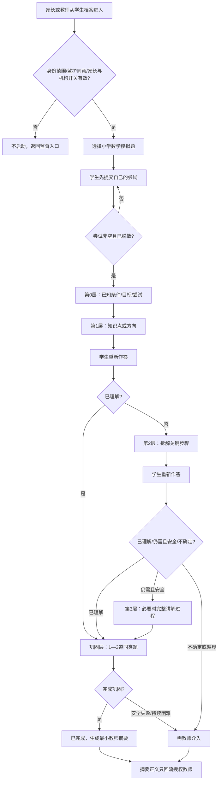

# 同芯AI学习流程

## 1. 状态与参与者

状态固定为：`未开始`、`引导中`、`需教师介入`、`已完成`、`已关闭`。授权角色只有家长与教师；学生仅是受监督会话内参与者，没有账号、角色或独立入口。

两种模式共享同一引导状态机：家长监督模式由有效 `GuardianRelationship` 守卫，教师监督模式由当前租户、校区与授权班级守卫；两种模式都必须有范围匹配、版本有效且未撤回的 `GuardianConsent`，并同时要求家长学生级开关与机构开关处于已开启。教师不能绕过监护同意。

## 2. 主流程



## 3. 进入守卫

1. 解析家长或教师的可信身份、当前 Membership、单一角色和 `tenant_id`。
2. 校验 `campus_id`；家长需已通过关系，教师需授权班级。
3. 两种模式均校验监护同意的学生/用途 scope、`consent_version`、`policy_version` 和未撤回状态，并同时校验家长学生级开关与机构开关均为已开启。
4. 创建会话时由服务端注入范围、监督模式、`supervisor_user_id`、`supervisor_membership_id` 及同意/开关版本；拒绝客户端租户 ID 或监督者替换。
5. 仅允许预置的模拟小学数学题；当前不上传图片、不调用模型。

任一守卫失败都停留 `未开始` 并返回安全说明，不泄露学生或对象是否存在。

## 4. 分层交互细则

- 第一次尝试前，只有“说明已知条件/目标并提交尝试”动作可用。
- 第0层确认学生对题意与自身尝试的表达；第1层只给知识点/方向。
- 每个提示层后必须有学生重新作答或明确请求下一层的可观察动作。
- 第2层后若已理解，直接进入巩固；只有仍需帮助且安全时才允许第3层。
- 第3层讲完整过程但不以裸答案替代解释，也不能扩展成开放问答。
- 巩固固定1—3题；完成后不能继续无限出题或聊天。

## 5. 转教师、关闭与降级

| 触发 | 状态 | 可观察结果 |
|---|---|---|
| 隐私/有害/作弊/越界请求 | `需教师介入` | 停止提示，显示一般安全说明，教师收到最小介入标记 |
| 题意/答案不确定 | `需教师介入` | 不猜测，不给答案，转授权教师 |
| Provider/RAG/Safety 服务不可用 | `需教师介入` 或 `已关闭` | 不伪造输出；保留已脱敏状态，提供返回/关闭 |
| 家长/教师主动转交 | `需教师介入` | 生成最小上下文，不自动发送给其他角色 |
| 家长撤回同意、暂停/关闭学生级开关或关系失效 | `需教师介入`或`已关闭` | 禁止新会话与现有会话续写，丢弃在途结果，返回监督入口 |
| 机构关闭开关 | `已关闭` | 禁止新会话，活动会话安全终止 |
| 家长/教师主动关闭 | `已关闭` | 记录原因类别与审计，不后台续跑 |

教师处理介入后可记录最小处理结果并把会话置 `已完成`；不能由系统自动判定教师处理完成。

## 6. 教师摘要流

```text
会话已完成或需教师介入
→ 校验原会话tenant/campus/班级范围
→ 生成最小摘要（尝试次数、提示层、巩固结果、安全标记、介入建议）
→ 仅授权教师工作台出现待查看
→ 教师已阅或介入处理
→ 返回更新后的教师工作台
```

家长、学生、工作人员、机构管理员、校区负责人、平台管理员不得接收正文。摘要生成失败时隐藏正文并允许授权教师重试/人工查看必要状态，不向其他角色降级泄露。

## 7. 监督和删除的并行状态

家长监督状态 `未同意→已同意/已拒绝→已开启→已暂停/已关闭` 与删除请求 `PENDING→COMPLETED/REJECTED` 相互独立。提交删除请求立即显示待处理；拒绝给非敏感原因并允许修正重提。暂停/恢复会话不能改变删除状态，删除请求也不暗中改变监督开关。

## 8. 审计与最小事件

记录会话开启/拒绝、监督模式、`supervisor_user_id`、`supervisor_membership_id`、同意/策略/开关版本、范围标识、提示层变化、转教师、关闭、摘要查看和删除请求状态；不记录生产密钥、签名 URL 或不必要的学生/题目正文。AI 会话与成本均绑定环境、`tenant_id`、`campus_id` 和会话 ID。

当前流程全部是模拟设计，不执行真实网络请求或数据持久化。
