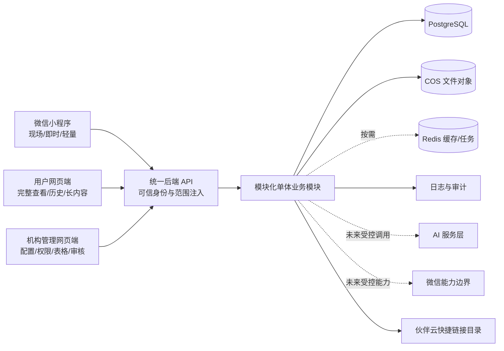

# 系统架构草案

## 1. 文档边界

本文是 Phase 1A 批次A的可审查设计稿，不是正式系统、应用脚手架或部署方案。所有示例均为模拟数据；本批次不创建业务代码、数据库迁移、云资源、外部连接或生产密钥。

## 2. 建议技术栈（仅设计）

| 层 | 建议 | 当前状态 |
|---|---|---|
| 微信小程序 | Taro + React + TypeScript | 只记录建议，不初始化 |
| 用户网页端 | Next.js + React | 只记录建议，不初始化 |
| 机构管理网页端 | Next.js | 只记录建议，不初始化 |
| 统一后端 API | NestJS 模块化单体 | 只划分边界，不生成代码 |
| 数据库 | PostgreSQL + Prisma | 只定义概念模型，不建迁移 |
| 缓存/任务 | Redis | 按需启用，默认不是必需依赖 |
| 文件 | 腾讯云 COS | 只定义隔离与生命周期，不创建桶 |
| 部署 | Docker + Nginx | 只作未来候选，不部署 |
| AI | Provider Adapter + RAG + Safety Gateway + Evaluation | 只定义产品、安全和评测边界，不调用模型 |

## 3. 三端与统一 API



三端共用账号、权限、业务规则、数据库与文件规则，但不复制相同页面。任何客户端都不是租户、校区或角色范围的权威来源。

## 4. 后端模块

模块化单体内划分：身份与 Membership、授权策略、租户/校区、公开内容、内部知识、内容发布、文件、家长关系与照护流程、教师任务与日报、AI 学习、审计、安全与外部适配。模块所有权、允许依赖与禁止耦合见 `MODULE_BOUNDARIES_DRAFT.md`。

统一请求入口执行：身份解析、当前 Membership/角色选择、`tenant_id` 与适用 `campus_id` 可信注入、对象级范围校验、业务规则、审计。公开读取也只能使用显式机构公开投影，不能借公开接口读取草稿或内部字段。

## 5. 数据、缓存与文件

- PostgreSQL 是未来业务事实来源；机构业务行带 `tenant_id`，校区业务带 `campus_id`。
- Prisma 仅是候选数据访问层；本批次不生成 schema 或迁移。
- Redis 只在有已验证的缓存、锁或异步任务需求时启用。缓存键、任务载荷和队列均必须包含服务端注入的租户范围，且不得成为权限判断来源。
- COS 对象按租户前缀隔离，校区对象继续分段；上传、读取、分享和删除均由后端授权。下载/分享链接短时有效。
- 数据库、缓存、任务和文件的完整规则分别见 `MULTI_TENANCY_DRAFT.md` 与 `FILE_STORAGE_DRAFT.md`。

## 6. 日志与审计

运行日志用于诊断，安全审计用于回答谁在何时以何范围对何对象执行何动作及结果。两者均写入 `tenant_id`、适用 `campus_id`、请求关联 ID 和最小必要元数据；不记录学生正文、AI 提示正文、手机号、令牌或文件签名 URL。审计记录不可由普通业务角色修改。

平台级运行日志与租户业务审计逻辑隔离。平台管理员默认只能查看平台元数据；查看租户业务内容必须单独批准、限时、最小字段并留下审计证据。

## 7. AI 服务层

未来 AI 请求只能经统一 AI 编排层：

```text
业务权限与同意校验
→ 输入最小化/脱敏
→ Safety Gateway
→ Provider Adapter（供应商可替换）
→ 可选受控 RAG
→ 输出安全检查
→ 分层提示状态机
→ 教师专属摘要与审计/成本归属
```

AI 会话、提示、检索上下文、审计和成本均按租户隔离。当前不接正式模型、不建立 RAG、不保存真实学生会话。

## 8. 外部能力边界

- 微信：未来可承载登录、消息或小程序能力，但必须经服务端适配器、最小权限、用户同意和环境隔离；当前不接微信授权、短信或支付。
- 伙伴云：V0.1 仅保存受控快捷链接记录。只有 `PUBLISHED + ENABLED` 且角色/范围通过时可显示；不调用伙伴云 API、不保存其账号或凭据。
- COS、AI 供应商及其他外部服务：均通过适配器边界，业务模块不直接持有生产凭据。

## 9. 环境隔离

`local`、`dev`、`test`、`staging`、`prod` 是未来概念环境。数据库、缓存命名空间、COS 位置、外部应用、AI 供应商配置、密钥和日志必须环境隔离，禁止跨环境复用生产数据或生产密钥。详细边界见 `ENVIRONMENTS_AND_DEPLOYMENT_DRAFT.md`。

## 10. 已作架构决策

1. 三端共享统一 API 与规则，端侧只负责适配场景。
2. 首期后端候选为模块化单体，避免过早拆分微服务。
3. PostgreSQL 是事实来源；Redis 按需启用，不能作为授权事实来源。
4. 租户、校区和对象范围由服务端可信上下文注入并默认拒绝。
5. 文件、AI 会话、成本、缓存、任务、日志和审计与业务数据同等隔离。
6. 外部能力通过适配器；伙伴云当前仅快捷链接。
7. 平台管理员默认无权查看学生具体内容。

## 11. 暂缓项

以下项目不在本批次决定或实现：容量与可用性目标、具体云拓扑、容灾参数、Redis 是否启用、消息队列、搜索引擎、微服务拆分、正式认证方式、生产数据库 schema、COS 桶策略、AI 供应商/RAG 索引、支付、伙伴云 API 和任何部署。它们必须由后续已批准任务基于真实约束决定。
