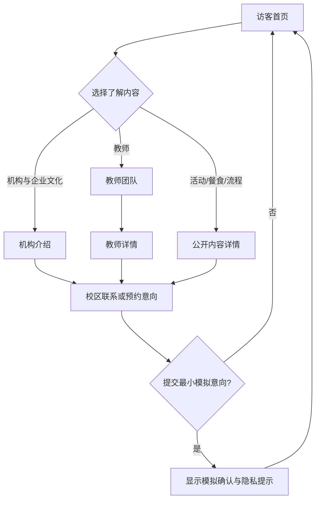
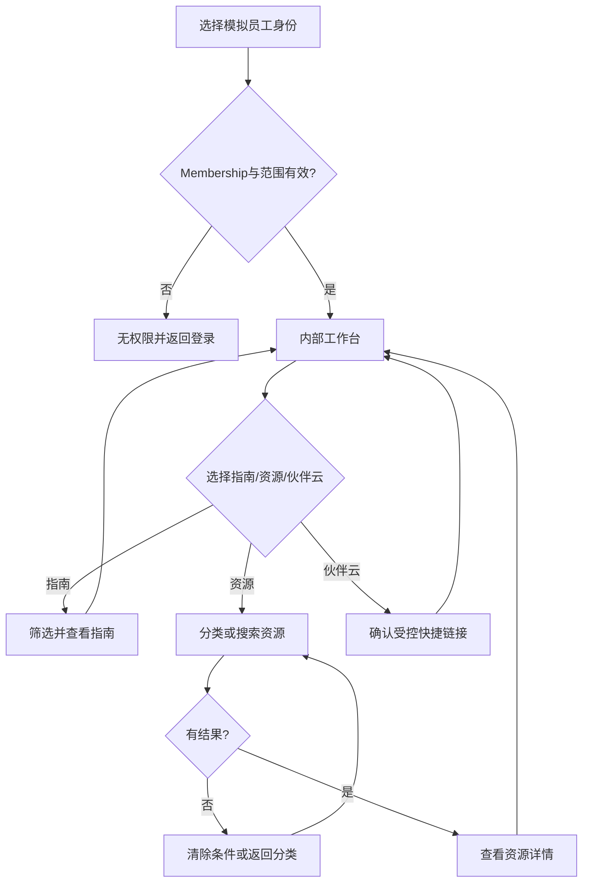
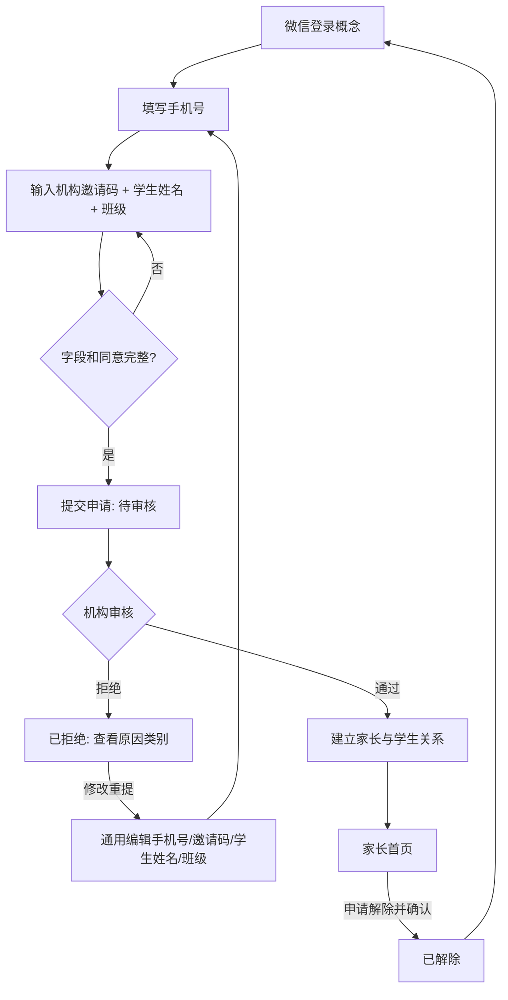
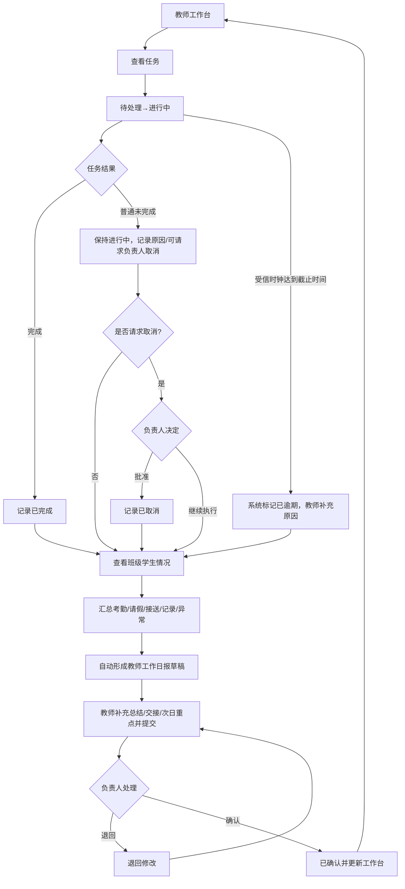
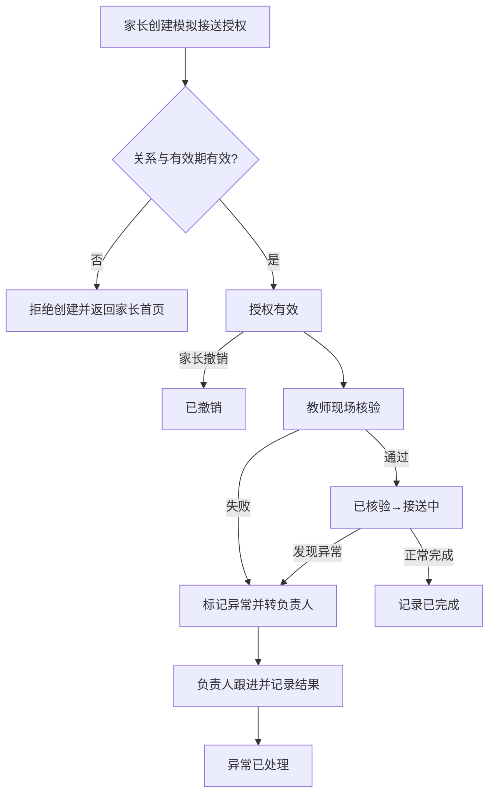
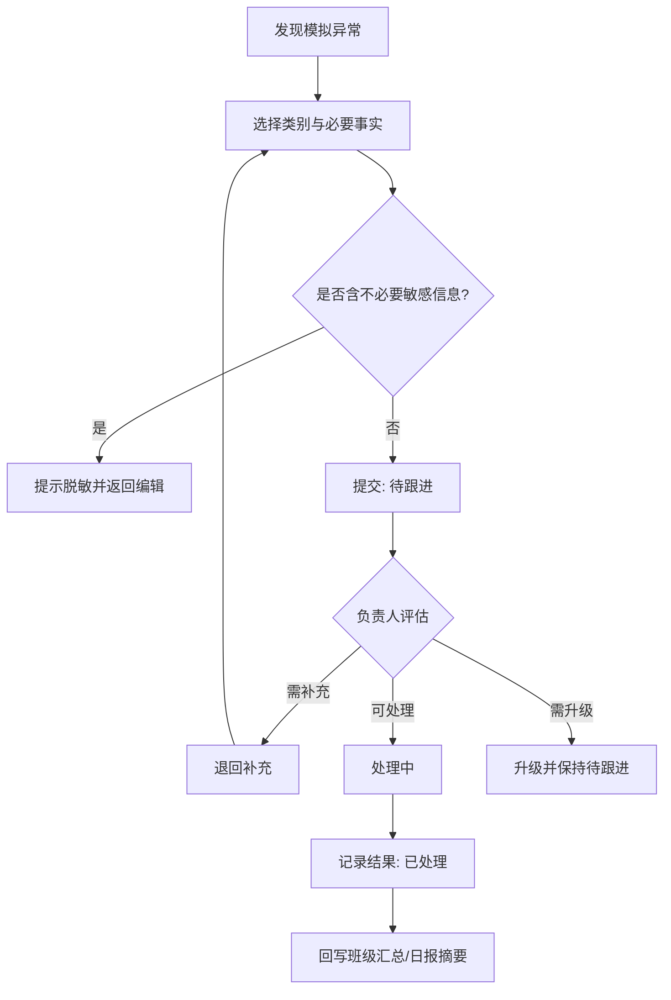
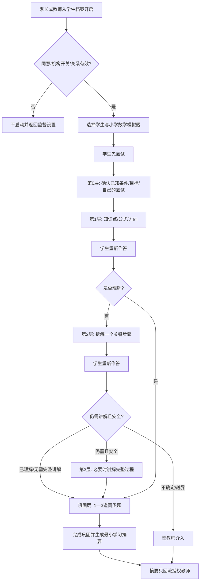
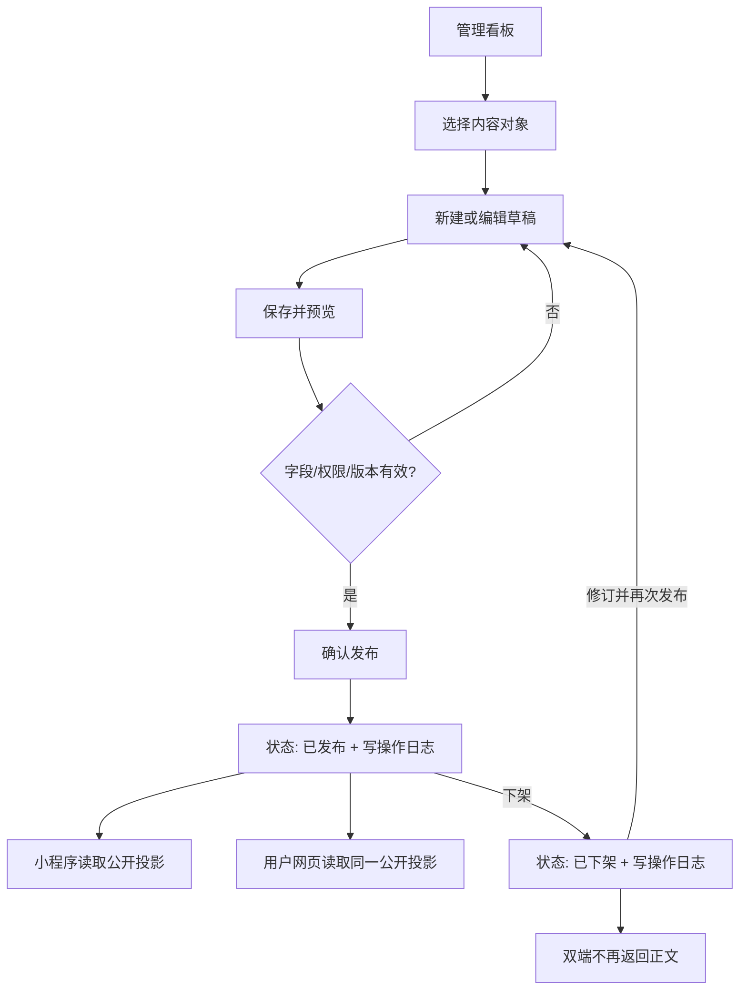

# 核心用户流程

## 1. 图示约定

- 每条流程同时提供 Mermaid 和等价文字回退；Mermaid 不可渲染时，文字版本仍是完整验收依据。
- 所有个人、机构与题目示例均为标注“模拟数据”的虚构占位内容。
- 本文描述低保真概念交互，不调用真实登录、短信、微信、伙伴云、支付、正式 AI 或生产数据库。
- 页面ID引用 `PAGE_INVENTORY.md`，状态引用 `STATE_MODEL.md`。

## 2. FLOW-01 访客了解机构

- **角色/端**：访客；微信小程序或用户网页端。
- **入口**：`A-MP-01` 或 `A-WEB-01`。
- **终态**：返回公开导航，或形成仅存在于原型内的模拟联系/预约确认。



**文字回退**：访客从首页选择机构介绍（含企业文化）、教师团队、活动、餐食或一日流程；查看详情后可以返回首页，也可以进入校区联系/预约意向。只有在填写最小模拟字段并确认后才显示“模拟意向已记录”的终态；不发送网络请求。无内容时返回公开导航，加载或提交失败时显示重试与返回。

## 3. FLOW-02 员工查看指南和资源

- **角色/端**：教师或工作人员；微信小程序或用户网页端。
- **入口**：`A-MP-11` 或 `A-WEB-08`。
- **终态**：完成阅读并返回工作台，或在确认后看到伙伴云模拟外部入口提示。



**文字回退**：员工选择模拟身份，范围有效才进入内部工作台。员工可以阅读新人指南，或按分类/搜索资源；无结果时可清除条件，有结果时进入详情并返回工作台。伙伴云只显示受控快捷链接确认，不调用 API、不保存凭据。无权限时回到登录入口且不泄露对象内容。

## 4. FLOW-03 家长与学生绑定

- **角色/端**：访客、家长、机构管理员、校区负责人；家长小程序/网页与管理网页。
- **入口**：`B-FLOW-01`。
- **终态**：已通过后进入家长首页；已拒绝可修改重提；已解除回到未绑定入口。



**文字回退**：顺序必须固定为微信登录概念、填写手机号、输入机构邀请码与学生姓名和班级、提交、机构审核、建立关系。缺字段不能提交；拒绝后进入通用编辑节点，可修改手机号、邀请码、学生姓名或班级，再从字段校验顺序重提；通过后进入家长首页；家长确认解除后关系进入已解除并回到未绑定入口。原型不实现真实微信登录、短信或审核服务。

## 5. FLOW-04 教师任务到工作日报

- **角色/端**：教师、机构管理员、校区负责人；教师小程序/网页与机构管理网页。
- **入口**：`B-FLOW-06`。
- **终态**：负责人确认后回到更新后的教师工作台；退回后教师修订重提，直到确认或保留为退回修改。



**文字回退**：教师从工作台开始任务。完成时进入已完成；普通未完成只记录原因并保持进行中，教师可请求机构管理员或校区负责人取消，只有负责人批准才进入已取消。仅受信时钟达到截止时间时系统才能标记已逾期，教师没有手动制造已逾期的动作。随后确认班级考勤、请假、接送、学生记录和异常汇总，系统概念性生成教师工作日报草稿；教师只补充工作总结、交接和次日重点后提交。机构管理员或校区负责人可以按范围退回或确认，退回后教师修订重提，确认后状态回写工作台。该日报不是学生托管日报，也不能用于自动绩效结论。

## 6. FLOW-05 接送授权与接送记录

- **角色/端**：家长、教师、机构管理员、校区负责人；家长端、教师端与管理网页。
- **入口**：`B-FLOW-05`。
- **终态**：已完成、异常待跟进、已撤销或已过期，并返回对应待办。



**文字回退**：家长只能为已关联学生创建最小模拟接送授权；无效关系或过期授权不能用于放行。家长可在核验前撤销。教师核验通过后进入接送中并记录完成；核验失败或过程异常时必须转负责人跟进，不能强行完成。所有终态返回家长或教师待办。

## 7. FLOW-06 异常上报和跟进

- **角色/端**：教师、机构管理员、校区负责人；教师端与管理网页。
- **入口**：教师工作台、`B-FLOW-08`班级学生情况或`B-FLOW-05`接送异常；由教师发起，机构管理员/校区负责人按范围跟进。
- **终态**：已处理并形成最小审计摘要，或升级后保持待跟进。



**文字回退**：教师从工作台、`B-FLOW-08`班级学生情况或`B-FLOW-05`接送异常发起，只填写类别和必要事实；若包含不必要敏感信息，必须脱敏后再提交。机构管理员或校区负责人只能在本机构/授权校区范围内退回补充、处理或升级；处理完成后只把必要摘要回写班级汇总和教师日报。工作人员不在该异常流程授权角色中。不得进行心理诊断、情绪识别、能力标签或自动纪律结论。

## 8. FLOW-07 AI学习助手提示式学习

- **角色/端**：家长或教师监督，学生不独立注册；家长/教师小程序或网页。
- **入口**：`B-FLOW-12` 或学生档案；主页面 `B-FLOW-10`，教师终点 `B-FLOW-11`。
- **终态**：完成巩固后摘要只回流教师；不确定、越界或模拟服务不可用时转教师或关闭。



**文字回退**：家长或教师必须从学生档案开启，学生没有独立注册。同意、机构开关和关系有效后，学生先提交自己的尝试；系统依次执行第0层确认已知条件、目标和尝试，第1层提示知识点/公式/方向，第2层拆解关键步骤，第3层只在必要时讲解完整过程，最后生成1—3道同类巩固题。不能从输入直接跳到答案。完成或需介入时，最小摘要只回流授权教师；模型不可用、安全越界或不确定时转教师或关闭。

## 9. FLOW-08 内容从后台发布到小程序和网页

- **角色/端**：机构管理员或授权校区负责人；机构管理网页、小程序和用户网页。
- **入口**：`A-ADM-02` 到对应管理列表，发布中心 `A-ADM-13`。
- **终态**：两个访客端读取同一已发布版本；下架后都不再返回正文；操作写基础日志。



**文字回退**：管理员在所属租户/校区范围内选择内容，编辑草稿、保存、预览并通过字段/权限/版本校验后发布；发布动作写基础操作日志，小程序和用户网页读取同一已发布投影。下架后两个公开端都不再返回正文；修订需要回到草稿流程再发布。列表排序作为相关管理列表操作，保存前后顺序和日志均可检查。

## 10. 流程覆盖回执

```text
USER_FLOW_COUNT=8
COMPLETE_LOOP_GUARDIAN_BINDING=FLOW-03
COMPLETE_LOOP_TEACHER_TASK_TO_REPORT=FLOW-04
COMPLETE_LOOP_AI_LEARNING=FLOW-07
AI_HINT_LAYERS=0,1,2,3,CONSOLIDATION
AI_SUMMARY_DESTINATION=AUTHORIZED_TEACHER_ONLY
```
